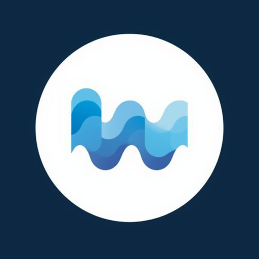

<div align="center">
  

  # UltraWhisper

  **Fast local transcription with 100% privacy, optimized for Apple Silicon**

  [](https://www.apple.com/macos)
  [](https://www.apple.com/mac)
  [](LICENSE)
  [](https://github.com/Rum1324/ultra-whisper-arm64/releases/latest)

</div>

---

## Features

- **🔒 100% Local & Private** - All transcription happens on your device. No internet required, no data leaves your Mac
- **⚡ Blazing Fast** - Metal GPU acceleration on Apple Silicon for real-time transcription
- **📋 Auto-Paste** - Automatically pastes transcribed text into your current app when done
- **🎙️ Two Capture Modes** - Choose between hold-to-talk or toggle recording
- **🌍 Multi-Language** - Auto-detect English and Japanese (more languages coming soon)
- **🎯 Menu Bar Integration** - Clean, native macOS status bar app with quick controls
- **📚 Custom Dictionary** - Add technical terms and domain-specific keywords for better accuracy
- **🎨 Flexible Visibility** - Show in menu bar only, Dock only, or both
- **🔊 Smart Audio** - Volume ducking during recording for clear capture

## Installation

### Download Pre-Built App

1. Download the latest `UltraWhisper-v0.5.0-macOS.zip` from the [Releases](https://github.com/Rum1324/ultra-whisper-arm64/releases/latest) page
2. Unzip and move **UltraWhisper.app** to your Applications folder
3. Right-click the app and select **Open** (required for first launch on macOS)
4. Grant permissions when prompted:
   - **Microphone** - For audio capture
   - **Accessibility** - For global hotkeys and auto-paste

### System Requirements

- macOS 13.0 (Ventura) or later
- Apple Silicon (M1, M2, M3, or later)
- 16GB RAM recommended for optimal performance

## Usage

### Quick Start

1. **Launch UltraWhisper** - Look for the app icon in your menu bar
2. **Start Recording**:
   - Click the menu bar icon → "Start Recording"
   - Or use your configured hotkey (default: hold ⌘⇧Space)
3. **Speak Clearly** into your microphone
4. **Stop Recording**:
   - Release the hotkey (hold-to-talk mode)
   - Or click "Stop Recording" (toggle mode)
5. **Get Your Text** - Transcribed text is automatically pasted into your active app

### Customization

Open **Settings** from the menu bar to customize:

- **Capture Mode**: Hold-to-talk vs. Toggle recording
- **Hotkeys**: Configure your preferred keyboard shortcuts
- **Custom Dictionary**: Add technical terms like "Kubernetes", "PostgreSQL", etc.
- **App Visibility**: Choose menu bar only, Dock only, or both
- **AI Handoff**: Optional macro to send transcribed text to AI assistants

## How It Works

UltraWhisper uses a hybrid architecture to deliver fast, private transcription:

1. **Frontend**: Flutter macOS app provides the native UI and system integration
2. **Backend**: Python service running [whisper.cpp](https://github.com/ggerganov/whisper.cpp) with Metal GPU acceleration
3. **GPU Acceleration**: Metal backend leverages Apple Silicon's GPU for real-time performance
4. **Model**: Whisper large-v3-turbo (GGML format) stored locally in the app bundle
5. **Communication**: WebSocket connection on localhost for low-latency audio streaming

**Privacy First**: Everything runs locally on your Mac. No cloud services, no telemetry, no data collection.

## Troubleshooting

### App won't open / "App is damaged" error
This is a macOS security feature. Fix:
```bash
xattr -cr /Applications/UltraWhisper.app
```
Then right-click the app and select "Open".

### No transcription output
- Check microphone permissions in **System Settings → Privacy & Security → Microphone**
- Ensure UltraWhisper has microphone access enabled
- Try restarting the app

### Poor transcription quality
- Add domain-specific terms to **Settings → Custom Dictionary**
- Speak clearly and minimize background noise
- Check your microphone input level in System Settings

### Menu bar icon not appearing
- Go to **Settings → App Visibility** and ensure it's not set to "Dock Only"
- Try restarting the app

### Auto-paste not working
- Grant Accessibility permissions in **System Settings → Privacy & Security → Accessibility**
- Ensure UltraWhisper is checked in the list

---

## For Developers

### Building from Source

#### Prerequisites
- Flutter SDK (stable channel) with macOS desktop support
- Xcode 14.0 or later
- Python 3.11+
- Homebrew (recommended)

#### Setup

1. **Clone the repository**
```bash
git clone https://github.com/Rum1324/ultra-whisper-arm64.git
cd ultra-whisper-arm64
```

2. **Install Flutter dependencies**
```bash
flutter pub get
```

3. **Set up Python backend**
```bash
cd backend
python -m venv venv
source venv/bin/activate
pip install -r requirements.txt
cd ..
```

4. **Run the app**
```bash
flutter run -d macos
```

5. **Build release version**
```bash
flutter build macos --release
```

The built app will be in `build/macos/Build/Products/Release/UltraWhisper.app`

### Project Structure

```
ultra-whisper-arm64/
├── lib/                      # Flutter/Dart frontend
│   ├── main.dart            # App entry point
│   ├── models/              # Data models
│   ├── services/            # Business logic
│   ├── widgets/             # UI components
│   └── windows/             # Multi-window architecture
├── macos/                   # macOS native code
│   └── Runner/
│       ├── AppDelegate.swift         # App lifecycle
│       ├── StatusBarController.swift # Menu bar integration
│       └── AppLifecycleHandler.swift # Dock visibility
├── backend/                 # Python transcription service
│   ├── server.py           # WebSocket server
│   └── requirements.txt    # Python dependencies
└── docs/                    # Documentation
```

### Key Technologies

- **Frontend**: Flutter, Swift
- **Backend**: Python, whisper.cpp (Metal GPU optimized)
- **Communication**: WebSocket (JSON + binary audio)
- **GPU Acceleration**: Metal (via whisper.cpp)
- **Audio Format**: 16kHz PCM, 16-bit mono

## Contributing

Contributions are welcome! Here's how you can help:

1. **Report Bugs**: Open an issue with detailed steps to reproduce
2. **Suggest Features**: Share your ideas in the issues section
3. **Submit PRs**:
   - Fork the repository
   - Create a feature branch (`git checkout -b feature/amazing-feature`)
   - Commit your changes (`git commit -m 'Add amazing feature'`)
   - Push to your branch (`git push origin feature/amazing-feature`)
   - Open a Pull Request

Please ensure your code follows the existing style and includes appropriate tests.

## License

This project is licensed under the MIT License - see the [LICENSE](LICENSE) file for details.

## Acknowledgments

- [OpenAI Whisper](https://github.com/openai/whisper) - The foundation model
- [whisper.cpp](https://github.com/ggerganov/whisper.cpp) - High-performance C++ inference with Metal GPU support
- [Flutter](https://flutter.dev) - Cross-platform UI framework

---

<div align="center">
  Made with ❤️ for Apple Silicon

  [Report Bug](https://github.com/Rum1324/ultra-whisper-arm64/issues) · [Request Feature](https://github.com/Rum1324/ultra-whisper-arm64/issues)
</div>
